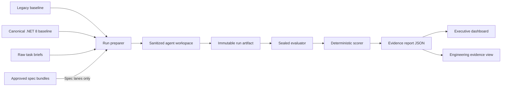

# Architecture

## Purpose

SpecForge separates scenario creation, specification authoring, agent execution, evaluation, and presentation so that no scored coding agent can inspect or influence its evaluator.

## Trust boundaries

### Authoring zone

This is split into independent authoring roles:

- Scenario maintainers own baseline behavior and raw briefs.
- Spec authors and reviewers own discovery and approved bundles but cannot access hidden evaluator source or expected results.
- Evaluator authors own hidden checks but cannot alter approved specs.
- Claim adjudicators review frozen configuration and generated evidence without changing either treatment.

No authoring repository content is copied wholesale into a scored agent workspace.

### Agent workspace

Contains only the selected baseline, the common task brief, and, for a spec lane, the approved spec bundle. A run-specific manifest records the expected model, lane, repetition, and content hashes. It excludes:

- The other episode baseline.
- Other lane prompts and outputs.
- Hidden evaluator source and expected results.
- Scoring weights and claim logic.
- Prior run conversations or evidence.
- Any Git refs or history that expose excluded content.

### Evaluation zone

Receives the completed run after execution. It applies hidden behavior, control, security, operability, and structural checks. Evaluation output is machine-readable and append-only within the run evidence directory.

Hidden checks must be defensible from baseline behavior and the raw brief. They cannot introduce requirements known only to a spec lane.

### Presentation zone

Consumes generated report JSON. It never recalculates hidden checks and cannot edit weights. It distinguishes illustrative from measured evidence on every decision surface.

## Repository responsibilities

| Path | Responsibility |
|---|---|
| `src/legacy-trade-reconciliation/` | Episode 1 baseline and public characterization fixtures |
| `src/canonical-modernized/` | Frozen Episode 2 baseline |
| `spec-factory/` | Discovery, authoring, review, quality gate, and approved spec bundles |
| `benchmark/` | Run preparation, import, scoring, aggregation, and claim state |
| `evaluator/` | Agent-hidden episode evaluators |
| `evidence/` | Illustrative and measured run artifacts |
| `dashboard/` | Read-only evidence presentation |
| `contracts/` | Versioned run and report schemas |

## Baseline strategy

The two episodes are independent:

- **Modernization** always starts from the legacy baseline tag.
- **Audit feature** always starts from the canonical modernized baseline tag.

This avoids compounding Episode 1 implementation quality into Episode 2 and preserves a fair four-lane comparison.

## Live execution adapters

The benchmark prepares a provider-neutral workspace and prompt bundle. A Copilot/app session adapter can launch that bundle in a clean session with an exact model selection. When direct invocation is unavailable, the same bundle can be exported and its completed workspace imported without changing the scoring path.
